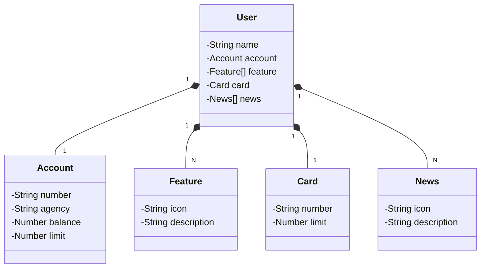

# Santander Dev Week 2024
Java RESTful API criada para a Santander Dev Week.

### Repositório publicado
https://github.com/C4rv4lh098/dio-api-santander-dev-week-2024

## Diagrama de Classes

```mermaid
classDiagram
    class User{
        -String name
        -Account account
        -Feature[] feature
        -Card card
        -News[] news
    }
    
    class Account{
        -String number
        -String agency
        -Number balance
        -Number limit
    }
    
    class Feature{
        -String icon
        -String description
    }
    
    class Card{
        -String number
        -Number limit
    }
    
    class News{
        -String icon
        -String description
    }
    
    User "1" *-- "1" Account
    User "1" *-- "N" Feature
    User "1" *-- "1" Card
    User "1" *-- "N" News
```
